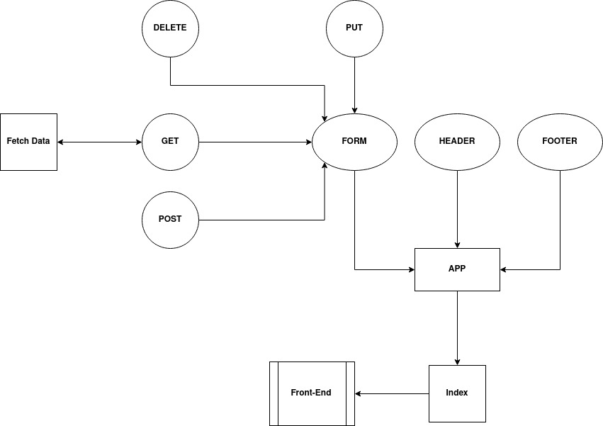

# resty

A simple React web app with a form that check which REST method has been choosen by the user and print it with the inputted URL.

- If the method is GET, the web app will get the data from the API URL and display it...

## Links

[Repository](https://github.com/AmjadMesmar/resty)
[Pull request](https://github.com/AmjadMesmar/resty/pull/5)
[Deployed App](https://souls-resty.herokuapp.com/)

## UML Diagram

