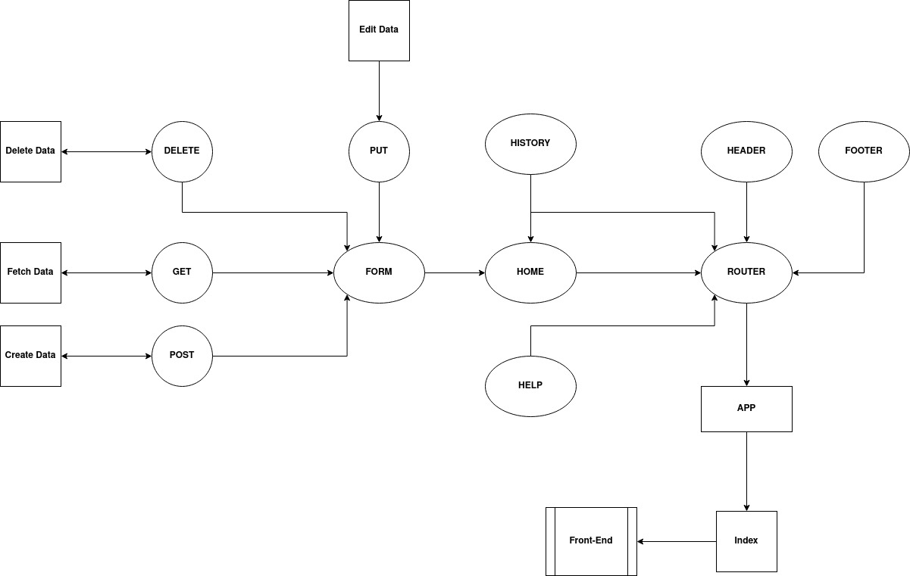

# RESTy

A simple React web app with a form that check which REST method has been choosen by the user and print it with the inputted URL.

- If the method is GET, the web app will get the data from the API URL and display it.
- If the method is POST, the web app will create data from the API URL and the body input.
- If the method is PUT, the web app will edit data from the API URL and the body input.
- If the method is DELETE, the web app will delete data from the API URL and the body input.

- The web app also has a History feature to help users get back to their older requests.

## Links

[Repository](https://github.com/AmjadMesmar/resty)
[Pull request](https://github.com/AmjadMesmar/resty/pull/2)
[Heroku](https://souls-resty.herokuapp.com/)
[Netlify](https://souls-resty.netlify.app/)

## UML Diagram

